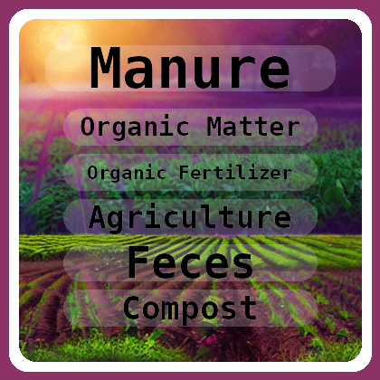

Taboo
================

<!-- WARNING: THIS FILE WAS AUTOGENERATED! DO NOT EDIT! -->

Taboo in python and Julia.

Build cards using Wikipedia and draw them.

Check the [docs](https://gpucce.github.io/Taboo.jl/) and see how it
works.

``` python
from PIL import Image
from Taboo import draw_card, load_taboo_words, add_taboo_words
```

``` python
print("organic farming")
Image.open("./test_data/raw_images/organic_farming_raw.png")
```

    organic farming


``` python
im = draw_card("./test_data/raw_images/organic_farming_raw.png")
im
```


``` python
taboo_words = load_taboo_words("./test_data/taboo_cards/Organic farming.json")["cards"]
taboo_words[:2]
```

    [{'Manure': ['Organic matter',
       'Organic fertilizer',
       'Agriculture',
       'Feces',
       'Compost',
       'Green manure',
       'Soil fertility',
       'Nutrient',
       'Nitrogen',
       'Bacteria']},
     {'Green manure': ['Agriculture',
       'Biomass (ecology)',
       'Manure',
       'Soil organic matter',
       'Legume',
       'Organic farming',
       'Intensive farming']}]

``` python
add_taboo_words(im, taboo_words[0])
```



``` python
add_taboo_words(im, taboo_words[2])
```


